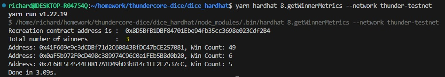

本 project 使用 hardhat 开发， 部署在 ThunderCore 测试网上，合约信息如下：

<table>
  <tr>
    <th>合约名称</th>
    <th>合约地址</th>
    <th>部署哈希</th>
  </tr>
  <tr>
    <td>TCUSD</td>
    <td>0xaCe55329Fb369f65548B4cE8f70982f016BdbC42</td>
    <td>0x63df5e08986b8d842900f010f13dd230ea51eaad2598a4ba40b887a07b17d635</td>
  </tr>
  <tr>
    <td>Recreation</td>
    <td>0x8D5BfB1DBF84701Ebe94fb35cc3698e023Cdf2B4</td>
    <td>0xa3cce72c8d223bc33077b3a5debf1661ab1fd5006e64037be79265905365d4b0</td>
  </tr>
</table>

具体功能参见 Recreation.sol 注释部分；

下面功能，请参见 tasks/8.getWinnerMetrics.js

Record user metrics

-   Who wins the most of tokens
-   The number of win counts for each user

下图为执行该 task 之后得到的结果：

